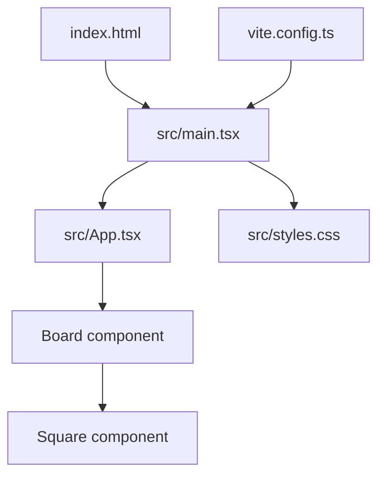

# Tic Tac Toe Web App Documentation

## Overview and Product Requirements

### Goal
The goal of this application is to provide a simple, modern, and responsive Tic Tac Toe game that allows two players to play locally in the browser. The app emphasizes clarity, smooth interactions, and a clean design following the Ocean Professional theme.

### Target Users
- Casual users who want to quickly play a game of Tic Tac Toe.
- Developers looking for a clean example of a React + Vite + TypeScript application with well-structured state and styling.

### Features
- Interactive 3x3 game board with click-based moves.
- Player turn indicator with accessible status messaging.
- Automatic detection of win and draw states.
- Game lock after a win or draw to prevent further moves.
- Reset control to start a fresh game with X as the first player.
- Ocean Professional theme with blue and amber accents and subtle gradients and shadows.
- Lightweight and fast with Vite, React 18, and TypeScript.

### Non-Goals
- No AI/CPU opponent.
- No persistence (scores/history).
- No external APIs or backend integration.

## Architecture

### Tech Stack
- React 18
- TypeScript
- Vite 5 (development server and bundler)
- CSS (custom, theme-oriented)

### Project Structure
- index.html — HTML shell bootstrapping the app
- src/main.tsx — React entry point that mounts the App component
- src/App.tsx — Main application component containing game logic, board rendering, and UI controls
- src/styles.css — Ocean Professional theme styles and component classes
- vite.config.ts — Vite configuration for React and server host settings
- package.json — scripts and dependencies
- tsconfig.json — TypeScript configuration

### Component Responsibilities
- App
  - Owns the game state: squares (board cells), xIsNext (current player).
  - Derives winner, winning line, and board-full status using calculateWinner and basic checks.
  - Renders the status header, Board, and controls.
  - Handles square clicks and reset logic.
- Board
  - Receives the squares array, handles per-square rendering, and highlights any winning line indices.
  - Delegates square click handling back to App via onSquareClick.
- Square
  - Stateless button displaying X, O, or empty.
  - Applies highlight styles when part of a winning line.

### State Flow
- App maintains:
  - squares: Player[] (length 9) where Player is 'X' | 'O' | null
  - xIsNext: boolean for current player toggle
- On user click:
  - If the clicked square is empty and the game is not over:
    - App updates squares with the current player's mark and toggles xIsNext.
- Derived state:
  - winner and line from calculateWinner(squares).
  - isBoardFull when all squares are non-null.
  - gameOver flag when a winner exists or the board is full.
- Board and Square are purely presentational; they receive data and callbacks via props.

### Data Model and Types
- type Player = 'X' | 'O' | null
- squares: Player[] with exactly nine entries, indexes 0..8 represent board cells

### Rendering Flow (Entry)
- index.html provides a root div and loads src/main.tsx as type="module".
- main.tsx mounts App into #root with React.StrictMode.

### Key Code Snippets

Entry and Mount:
```typescript
// src/main.tsx
import React from 'react'
import { createRoot } from 'react-dom/client'
import App from './App'
import './styles.css'

const rootEl = document.getElementById('root')
if (rootEl) {
  const root = createRoot(rootEl)
  root.render(
    <React.StrictMode>
      <App />
    </React.StrictMode>
  )
}
```

Winner Calculation:
```typescript
// src/App.tsx (excerpt)
type Player = 'X' | 'O' | null

function calculateWinner(squares: Player[]): { winner: Player; line: number[] | null } {
  const lines = [
    [0, 1, 2],[3, 4, 5],[6, 7, 8], // rows
    [0, 3, 6],[1, 4, 7],[2, 5, 8], // cols
    [0, 4, 8],[2, 4, 6]            // diagonals
  ]
  for (const [a, b, c] of lines) {
    if (squares[a] && squares[a] === squares[b] && squares[a] === squares[c]) {
      return { winner: squares[a], line: [a, b, c] }
    }
  }
  return { winner: null, line: null }
}
```

Game State and Actions:
```typescript
// src/App.tsx (excerpt)
const [squares, setSquares] = useState<Player[]>(Array(9).fill(null))
const [xIsNext, setXIsNext] = useState<boolean>(true)

const { winner, line } = useMemo(() => calculateWinner(squares), [squares])
const isBoardFull = useMemo(() => squares.every(Boolean), [squares])
const gameOver = !!winner || isBoardFull

function handleSquareClick(i: number) {
  if (squares[i] || gameOver) return
  const next = squares.slice()
  next[i] = xIsNext ? 'X' : 'O'
  setSquares(next)
  setXIsNext(!xIsNext)
}

function handleReset() {
  setSquares(Array(9).fill(null))
  setXIsNext(true)
}
```

## Game Logic Specification

### Turn Rules
- X always starts first when the app loads or after a reset.
- Players alternate turns (X, then O, then X, etc.).
- Clicking an already filled square has no effect.
- When a game has ended (win or draw), further clicks are ignored until reset.

### Win Detection
- The game checks eight possible winning lines:
  - Rows: [0,1,2], [3,4,5], [6,7,8]
  - Columns: [0,3,6], [1,4,7], [2,5,8]
  - Diagonals: [0,4,8], [2,4,6]
- If any line contains the same non-null symbol in all three positions, that player is the winner.
- The winning line is recorded and passed to the Board to visually highlight the three winning squares.

### Draw Detection
- If all nine squares are filled and there is no winner, the game declares a draw.

### Reset Behavior
- The Reset button clears the board to all null values and sets xIsNext to true, making X the next player.
- The status indicator updates to reflect the starting state.

## Theming and Design Guidelines

### Ocean Professional Palette
- Primary: #2563EB (blue)
- Secondary/Success: #F59E0B (amber)
- Error: #EF4444 (red)
- Background: #f9fafb (light gray)
- Surface: #ffffff (white)
- Text: #111827 (near-black)
- Muted: #6b7280 (gray)
- Ring: rgba(37, 99, 235, 0.35)

These are defined as CSS variables in :root within src/styles.css. The design uses rounded corners, subtle shadows, gradients, and smooth transitions to create a modern and minimal visual.

### Usage Guidelines
- Use var(--primary) for accents, focus rings, and highlighted states.
- Use var(--secondary)/var(--success) for win-status coloring and emphasis.
- Maintain clear contrast between text (var(--text)) and backgrounds (var(--surface)/var(--bg)).
- Use shadows and gradients sparingly to add depth without clutter.

### Component Styling Notes
- .status elements reflect turn, win, or draw through modifier classes:
  - .status--turn uses primary color.
  - .status--win uses success/amber and a subtle inset glow.
  - .status--draw uses muted gray.
- .square buttons:
  - Highlighted winning squares apply .square--highlight, which adds a ring and primary tint.
  - Filled squares use a slightly different gradient to suggest a pressed state.
- Buttons (.btn):
  - Use a blue gradient background, white text, and hover/active transitions.

## Setup and Run

### Requirements
- Node.js (LTS recommended)
- npm

### Installation
1. Navigate to the frontend container directory:
   - browser-tic-tac-toe-31225-31234/tic_tac_toe_frontend
2. Install dependencies:
   ```bash
   npm install
   ```

### Development
- Start the development server:
  ```bash
  npm run dev
  ```
- Open the URL printed in the console (defaults to http://localhost:5173).
- The server is configured with host: true in vite.config.ts to ease containerized or remote access.

### Production Build and Preview
- Build:
  ```bash
  npm run build
  ```
- Preview the production build locally:
  ```bash
  npm run preview
  ```
- Preview runs by default on http://localhost:4173.

### Environment
- No external APIs or environment variables are required.
- The app is fully client-side.

## Future Enhancements

- Move History and Time Travel:
  - Track and display move history; allow users to jump to prior board states.
- Single-Player Mode:
  - Add an AI opponent with adjustable difficulty (e.g., Minimax for optimal play).
- Animations:
  - Add subtle animations for placing marks and for winning line highlight transitions.
- Accessibility Improvements:
  - Add keyboard navigation for squares and ARIA descriptions for winning states.
- Persistent Scores:
  - Track session-based or local-storage-based win/loss/draw counts.
- Theming Toggle:
  - Add dark mode or alternative theme variants.

## Appendix

### Project Structure Diagram


### Accessibility Notes
- Status text uses aria-live="polite" to announce status changes such as turns, wins, and draws.
- Buttons include descriptive aria-labels for squares and controls.
- Visual emphasis and color coding are paired with text content for clarity.

---
Sources:
- tic_tac_toe_frontend/src/App.tsx
- tic_tac_toe_frontend/src/main.tsx
- tic_tac_toe_frontend/src/styles.css
- tic_tac_toe_frontend/index.html
- tic_tac_toe_frontend/vite.config.ts
- tic_tac_toe_frontend/package.json
