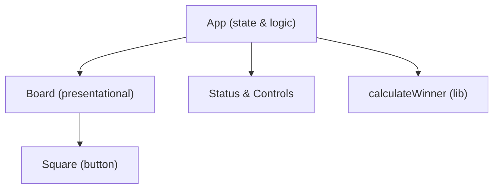
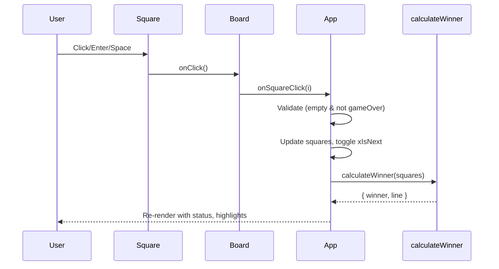

# Tic Tac Toe Frontend – Architecture Overview

## System Overview
This is a single-page React application built with Vite and TypeScript. It renders a 3x3 Tic Tac Toe board for two local players and applies a modern Ocean Professional theme. The application is fully client-side and requires no external APIs or environment variables.

## Component Structure
- App (src/App.tsx)
  - Owns game state: the 9-square board and current player flag.
  - Derives winner, winning line, board-full, and game-over states.
  - Renders the status header, Board, and controls.
  - Handles square clicks and reset actions.
- Board (src/components/Board.tsx)
  - Presentational; renders 9 Square components in a grid.
  - Receives squares, highlightLine, and disabled from App.
  - Delegates click handling back to App via onSquareClick.
- Square (src/components/Square.tsx)
  - Stateless button; displays X, O, or empty.
  - Applies highlight styles for winning squares.
  - Provides keyboard activation via Enter/Space and accessible labeling.

### Textual Diagram

## State Management
App component manages all state using React hooks:
- squares: Player[] where Player is 'X' | 'O' | null; length is 9, indices 0..8.
- xIsNext: boolean toggled on each valid move.

Derived state via useMemo:
- { winner, line } from calculateWinner(squares).
- isBoardFull from a non-null check across squares.
- gameOver computed from winner or isBoardFull.

Board and Square are pure presentational components that receive data and callbacks via props.

## Data Flow
- User clicks a Square button in the Board.
- Board calls onSquareClick(index) passed from App.
- App validates the move (ignore if filled or gameOver).
- App updates squares and toggles xIsNext.
- App recomputes derived state; UI re-renders with updated status and highlights.

### Data Flow Diagram

## Key Utilities (e.g., calculateWinner)
- calculateWinner (src/lib/calculateWinner.ts)
  - Input: Player[] of length 9.
  - Output: { winner: 'X' | 'O' | null, line: number[] | null }.
  - Checks all eight lines (rows, columns, diagonals); returns the winning player and line or null otherwise.

## Styling and Theming (Ocean Professional)
- Style: Modern, minimalistic with subtle shadows, rounded corners, and smooth transitions.
- Palette:
  - primary: #2563EB (accents, focus rings)
  - secondary/success: #F59E0B (win emphasis)
  - error: #EF4444
  - background: #f9fafb
  - surface: #ffffff
  - text: #111827
- Implementation:
  - CSS variables in src/styles.css (:root) define palette and common tokens (radius, shadow).
  - Components use modifiers:
    - status--turn (primary color),
    - status--win (amber emphasis),
    - status--draw (muted).
    - square--highlight (ring/tint for winning line).
- Guidance:
  - Use var(--primary) to indicate interactive or focused states.
  - Pair color cues with text for clarity.
  - Maintain contrast between text and background for readability.

## Accessibility
- Status updates use aria-live="polite" to announce turns and results.
- Squares are buttons with role="gridcell", descriptive aria-labels, and aria-pressed to reflect state.
- Keyboard support: Enter/Space triggers square placement when enabled; focus-visible styles are present.
- The board container has role="grid" and an informative aria-label.

## Build and Tooling (Vite, ESLint, Prettier)
- Vite 5 provides fast dev server and production builds.
- TypeScript configuration is strict and includes unused checks.
- ESLint + Prettier scripts exist for linting and formatting.
- Dev server is configured with host: true in vite.config.ts for containerized or remote scenarios.

Scripts (from package.json):
- dev: start Vite dev server (default http://localhost:5173)
- build: typecheck with tsc -b, then produce a production build
- preview: serve the built app locally (default http://localhost:4173)
- lint / lint:fix: run ESLint (with and without auto-fix)
- format: run Prettier
- typecheck: run TypeScript in build mode

## Testing Strategy (future work with Vitest/RTL)
- Unit tests:
  - calculateWinner: cover all winning variants and no-winner cases.
- Component tests (React Testing Library):
  - App renders title, places marks, toggles turns, and locks after game over.
  - Keyboard interactions with squares and aria-live assertions for status.
- Integration scenarios:
  - Full playthrough ending in a win and in a draw.
- Execution:
  - Introduce Vitest and RTL in future iteration with scripts "test" and "test:run".

## Operations
- Run locally:
  - npm install
  - npm run dev
- Production:
  - npm run build
  - npm run preview
- No environment variables or external services required for operation.
- No backend or network dependencies.

## Risks and Considerations
- Adding features like AI or move history may require state refactoring (e.g., reducer or dedicated game state module).
- Accessibility enhancements such as arrow key navigation and advanced announcements can be added without altering the core architecture but should be validated with testing tools.

---
Sources:
- src/App.tsx
- src/components/Board.tsx
- src/components/Square.tsx
- src/lib/calculateWinner.ts
- src/styles.css
- index.html
- vite.config.ts
- package.json
- tsconfig.json
